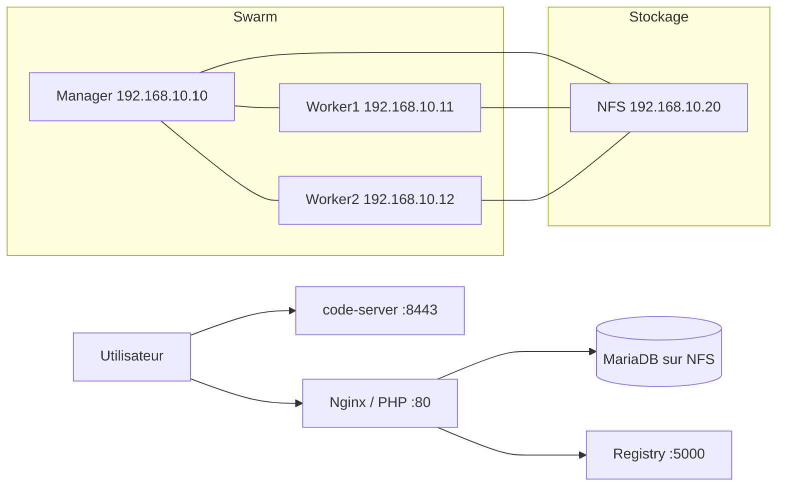

# Docker Swarm - Résilience & Continuité d'Activité

## Architecture



- Manager : 192.168.10.10
- Worker1 : 192.168.10.11
- Worker2 : 192.168.10.12
- NFS : 192.168.10.20

## Services déployés

- Registry : 5000
- Nginx/PHP : 80
- MariaDB sur NFS
- code-server : 8443

## Déploiement

```bash
git clone https://github.com/prenom-nom/swarm
cd swarm
docker stack deploy -c docker-stack.yml prod
```

## Tests PCA/PRA

Voir la documentation dédiée : [docs/08-pca-pra.md](docs/08-pca-pra.md)

## Objectif du projet

Ce projet met en place un cluster Docker Swarm sur 4 VM Debian pour démontrer la résilience, la reprise de service et la persistance des données via NFS.

## Références

- Roadmap complète : [docs/ROADMAP DOCKER SWARM.md](docs/ROADMAP%20DOCKER%20SWARM.md)
- Phases du projet : [docs/Phase 1 Docker Swarm.md](01-architecture.md)
